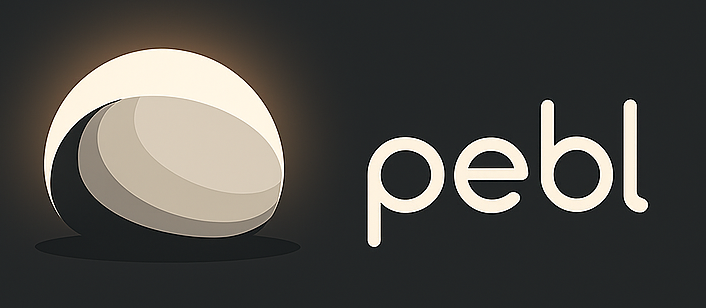

 Pebl Habit Tracker

[](https://flutter.dev)
[](https://dart.dev)
[](https://opensource.org/licenses/MIT)

> *"One pebble a day, a mountain someday."*

Pebl is a minimalist habit tracker designed to help you build consistent routines one habit at a time. With its clean interface and delightful animations, staying motivated has never been easier.

---

## ✨ Features

🔥 **Daily Habit Tracking** – Check off habits and watch your streaks grow  
📊 **Heatmap Calendar** – Visualize habit completion with a clean calendar view  
🎯 **Group Organization** – Organize habits into color-coded groups for clarity  
🎉 **Streak Rewards** – Confetti animations and streak badges celebrate consistency  
🎨 **Custom Themes** – Pick from hand-curated colors for each group  
⚡ **Smooth UX** – Blurred glass dialogs and haptic feedback for a delightful experience  
💾 **Offline-first** – All data stored locally using Hive

---

## 📦 Data Model Overview

The app uses Hive for local data storage with a simple yet effective structure:

```
┌────────────────────┐          ┌──────────────────────┐
│  HabitGroup (Box)  │          │     Habit (Box)      │
└────────────────────┘          └──────────────────────┘
          │                                 │
          │                                 │
┌────────────────────┐          ┌────────────────────────────┐
│ id: String (UUID)  │          │ id: String (UUID)          │
│ name: String       │          │ name: String               │
│ colorValue: int    │          │ completedDates: List<Date> │
└────────────────────┘          │ groupId: String (UUID)     │
                                └────────────────────────────┘
```

---

## 🚀 Getting Started

### Prerequisites

- Flutter SDK (latest stable version)
- Dart SDK
- Android Studio / VS Code with Flutter extensions

### Installation

1. **Clone the repository**
   ```bash
   git clone https://github.com/yourusername/pebl.git
   cd pebl
   ```

2. **Install dependencies**
   ```bash
   flutter pub get
   ```

3. **Generate Hive Adapters**
   ```bash
   flutter packages pub run build_runner build --delete-conflicting-outputs
   ```

4. **Run the app**
   ```bash
   flutter run
   ```

---

## 🧰 Tech Stack

| Technology           | Purpose |
|----------------------|---------|
| **Flutter**          | Cross-platform UI toolkit |
| **Dart**             | Programming language |
| **Hive**             | Lightweight local database |
| **Provider**         | State management |
| **Font Awesome**     | Icons |
| **Flutter Confetti** | Rewarding animations |

---

## 📱 Screenshots

> *Screenshots coming soon! Feel free to contribute by adding them.*

---

## 🤝 Contributing

Contributions are welcome! Please feel free to submit a Pull Request. For major changes, please open an issue first to discuss what you would like to change.

### Development Setup

1. Fork the repository
2. Create your feature branch (`git checkout -b feature/AmazingFeature`)
3. Commit your changes (`git commit -m 'Add some AmazingFeature'`)
4. Push to the branch (`git push origin feature/AmazingFeature`)
5. Open a Pull Request

---

## 📝 License

This project is licensed under the MIT License - see the [LICENSE](LICENSE) file for details.

---

## 🙏 Acknowledgments

- Flutter team for the amazing framework
- Hive contributors for the excellent local database solution
- All contributors who help make Pebl better

---


**Made with ❤️ and Flutter**

[⭐ Star this repo](https://github.com/yourusername/pebl) if you found it helpful!

